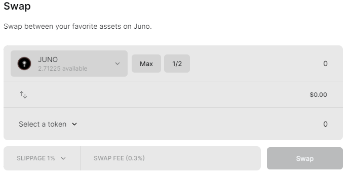

# Swap Assets

The primary function of JunoSwap is to enable users to swap assets on the Juno Network. This is achieved through an easy to use interface which has followed the standard design elements used throughout the cryptocurrency ecosystem. The intention is to create a seamless user experience.

### Perform an asset swap

Before we begin, ensure that you have assets available on Juno Network to swap. Follow [this](connect-keplr-+-deposit-assets.md) guide to deposit assets for use with JunoSwap.

Select the "Swap" page form the sidebar.

.png>)

On the **Swap** page, locate the assets drop down menu.

Select the dropdown for a list of assets to swap from. Select the asset you would like to swap by clicking the line with your asset. We are going to select HUAHUA.

.png>)

Repeat this process with the **select a token** drop down menu located at the bottom of the swap card.

.png>)

After selecting your assets you wish to swap, you can select the amount. For this tutorial, we will swap all available HUAHUA for Juno. We will select the **Max** button to automatically populate the maximum amount of HUAHUA we can swap.

.png>)

We will click "Swap" to complete the swap. You will be presented with a Keplr transaction popup. Review the transaction data and click the  "Approve" button.

.png>)

Congratulations, you have completed an asset swap. Your assets will be credited to your Juno wallet.

